# ReactVR _Importing 3D Models_

## Installation 🏜

- Click on the link to visit the repo (with the installation steps)

[Default installation](https://github.com/nadiamariduena/react-vr-intro1)

[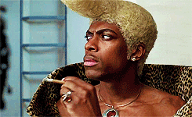](https://github.com/nadiamariduena/react-vr-intro1)

<br>
<br>
<br>

#### _AFTER YOU HAVE INSTALLED THE DEFAULT SETTINGS_

<br>

- CHANGE/UPDATE the chess default image
- Download this image and add it to the static_assets FOLDER

[Download this photo at the highest resolution](https://flic.kr/p/5C3Bcx)

<br>

- Name the image Space.jpg

- Finally, let’s update the Pano component in index.vr.js like so:

```javascript
//
<Pano source={asset("Space.jpg")} />
//
//
//
//  ---------------- ° ------------------
//  HERE in this area of the file
//  ---------------- ° ------------------
//
export default class RecatVrIntro4_importing3dModels extends React.Component {
  render() {
    return (
      <View>
        <Pano source={asset('chess-world.jpg')}/>
        <Text
          style={{
```

<br>

- Also, go ahead and remove the Text component.

<br>

#### RESULT 👾

[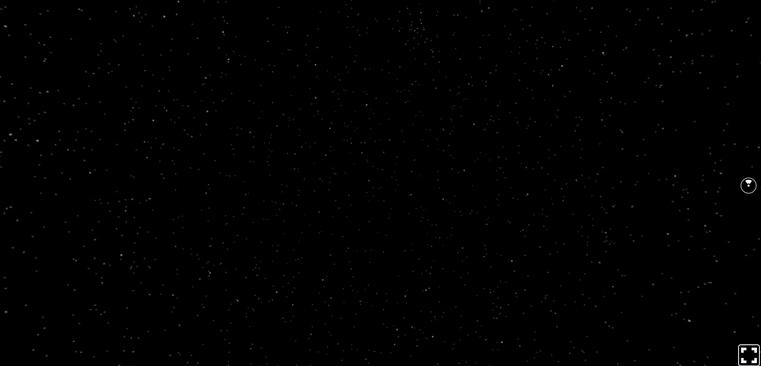]()

<br>
<br>
<hr>
<br>
<br>

## NOW GRAB THE 3D MODELS

- The best library for free 3D models that I have found is [Clara.io.](https://clara.io/library) , they have a wide variety of 3D models and formats for exporting the 3D models.

##### Search "Death Star"! 👾

<br>

[]()

<br>
<br>

#### 👾 Click on Download and select Wavefront OBJ (.obj)

- Currently, this is the file format that React VR supports.

<br>
<br>

[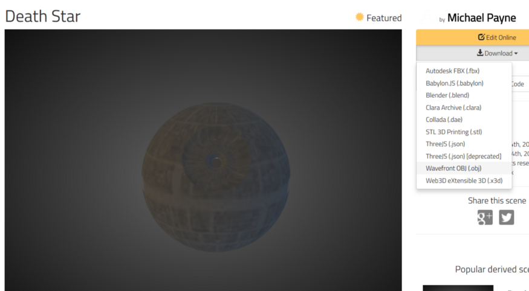]()

<br>
<br>

##### OH YEAH (you have to create an account) to download the stuff... is okay :)

[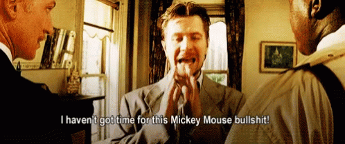]()

##### WHILE WE ARE AT IT...

- You can use programs like Blender, 3DS Max, or Maya to create a 3D model and export it to these formats.
  <br>

- There's also a lot of sites where you can download 3D models either for free or at a cost. The following are three of the best ones:

<br>

[TF3DM](https://free3d.com/)

[TurboSquid](https://www.turbosquid.com/Search/3D-Models/free)

[CGTrader](https://www.cgtrader.com/)

[POLY](https://poly.google.com/)

<br>
<br>

### Go ahead and download the Death star ZIP 🐖

- Extract this zip folder into the static_assets folder.
  We can now see two new files:

  <br>

  <div style="display: flex; justify-content: center;">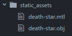</div>

  <br>

- The file ending in .mtl refers to the material of the model.
- The file ending in .obj refers to the object of the model.
- I like to think of .obj files as the container and .mtl as the fill.

<br>

mtl is the yellow and the "white" is the .obj "the container"

  <div style="display: flex; justify-content: center;">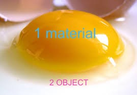</div>

  <br>
  <br>

### Visualizing the Object

- Since you might be curious to see this difference even more clearly, we can actually render just the object with no material.

<br>

- In index.vr.js, let’s import model:

```javascript
import { AppRegistry, asset, Pano, Text, View, Model } from "react-vr";
```

<br>

NOW render the death-star.obj like so:

```javascript
<View>
  <Pano source={asset("Space.jpg")} />
  <Model
    source={{
      obj: asset("death-star.obj"),
    }}
  />
</View>
```

<br>

#### RESULT 👾

  <div style="display: flex; justify-content: center;">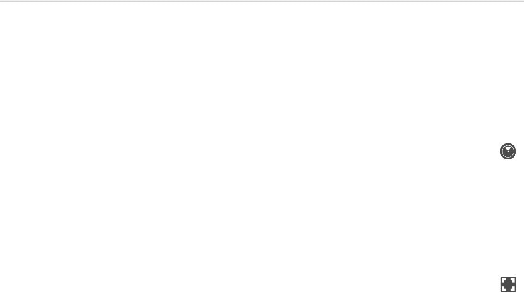</div>

- A _GIANT_ white page, I refreshed many times thinking there was an issue , then i tried with another browser, then i thought "what if the moon was already there but just too big" so i zoomed out with the browser but it doesn't work like that.

<br>

  <div style="display: flex; justify-content: center;">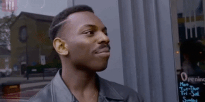</div>

<br>

##### SO I TRIED THE FOLLOWING

- ADD THE STYLE under the source "block" , the -2 is going to make the white moon zoom out (1 is really close)

```javascript
<View>
  <Pano source={asset("Space.jpg")} />
  <Model
    source={{
      obj: asset("death-star.obj"),
    }}
    style={{
      transform: [{ translate: [0, 0, -2] }], // add the -2 (2 meters back from the starting point)
    }}
  />
</View>
```

<br>

- In the code above, we are placing this object 2 meters back from the starting point.
  <br>

#### To better see the object, we can also make it a wireframe by adding the following property:

```javascript
<Model
  source={{
    obj: asset("death-star.obj"),
  }}
  style={{
    transform: [{ translate: [0, 0, -2] }],
  }}
  wireframe={true} // <---- ADD THIS
/>
```

##### it will add something like this:

   <div style="display: flex; justify-content: center;">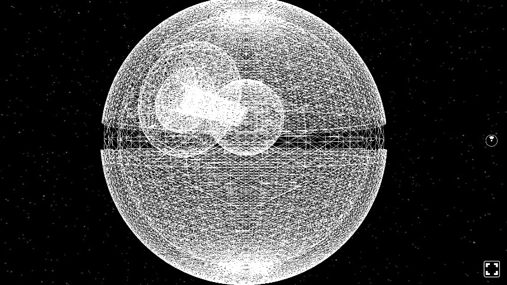</div>

<br>

##### NOW CHANGE the following

- CHANGE the recently added "wireframe" from TRUE to FALSE

<br>

#### IMPORTANT !! 🐖

> Edit: The generated death-star.mtl file is supposed to be applying the screenshot texture (that is also in static_assets) to the model. Despite several efforts, I could not get this file to work. Fortunately, there is a texture property where we can specify an http address for a texture image in place of using the .mtl file.

<br>

#### To understand it better:

[Getting Started with React VR](https://www.pluralsight.com/guides/getting-started-with-react-vr)

- I tried to replace few stuff inside the mtl file, like you can see in the link above, but i suspect that you have to do it directly from a software like maya , 3ds max etc to produce a file like this, i tried and it didnt work.

 <div style="display: flex; justify-content: center;">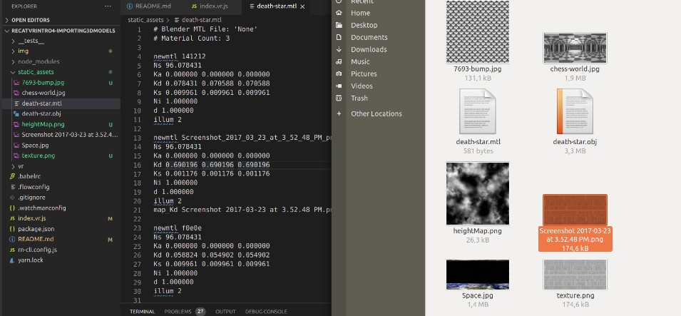</div>

<br>

##### You can update your code to the following:

```javascript
<Model
  source={{
    obj: asset("death-star.obj"),
    //mtl: asset('death-star.mtl')
  }}
  style={{
    transform: [{ translate: [0, 0, -2] }],
  }}
  //
  // --------- this
  //
  texture={"https://s3-us-west-2.amazonaws.com/s.cdpn.io/827672/death-star.png"}
  wireframe={false}
  //
  // --------- this
  //
/>
```

<br>

### Result 👾

<div style="display: flex; justify-content: center;">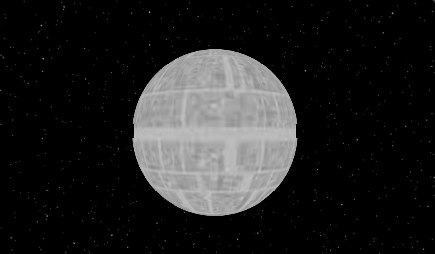</div>

#### NOW rotate a bit

```javascript
style={{
  transform: [
    {translate: [0, 0, -2]},
    {rotateY: '110deg'}
  ]
}}
```

<br>
<br>
<br>
<hr>
<br>
<br>

# 🏜️ ANIMATION 🏜️

<br>
<br>

### In order to do this, we have to import Animated (let’s also import Easing):

```javascript
import {
  AppRegistry,
  asset,
  Pano,
  Text,
  View,
  Model,
  Animated,
} from "react-vr";

//
import { Easing } from "react-native";
```

<br>

### Add a local state that will have an "Animated.Value" called "rotation":

```javascript
export default class StarWarsModeling extends React.Component {
  constructor() {
    super();
    // Animated.Value
    this.state = { spin: new Animated.Value(0) };
  }
  //more stuff
}
```

### Bind some inline styling for a rotateZ transformation to this:

```javascript
// this goes inside the data with the images
style={{
  transform: [
    {translate: [0, 0, -8]},
    {rotate: this.state.spin})
  ]
}}
```

##### Like so:

```javascript
<View>
  <Pano source={asset("Space.jpg")} />
  <Model
    source={{
      obj: asset("death-star.obj"),
      //mtl: asset('death-star.mtl')
    }}
    style={{
      transform: [{ translate: [0, 0, -8] }, { rotate: this.state.spin }],
    }}
    texture={
      "https://s3-us-west-2.amazonaws.com/s.cdpn.io/827672/death-star.png"
    }
    wireframe={false}
  />
</View>
```

#### Additionally, we do a timing animation within a componentDidMount lifecycle so the rotation value goes from 0 to 1 in 3 seconds:

```javascript
componentDidMount() {
  Animated.timing(
    this.state.spin,
    {
     toValue: 1,
     duration: 3000,
     easing: Easing.ease
    }
  ).start();
}
```

#### Add it here:

```javascript
  constructor() {
    super();
    this.state = { spin: new Animated.Value(0) };
  }
  //
  //
  componentDidMount() {
    Animated.timing(this.state.spin, {
      toValue: 1,
      duration: 3000,
      easing: Easing.ease,
    }).start();
  }
  //
  render() {
    return (
```

#### After adding the above, the moon will disappear, and that is because:

- rotate transformations have to be strings according to the React VR official documentation:

<div style="display: flex; justify-content: center;">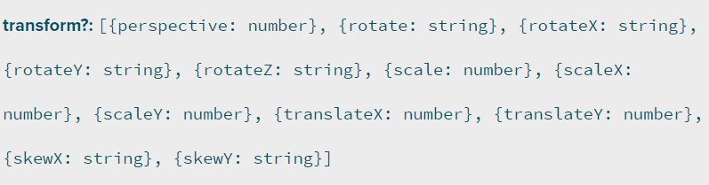</div>

<br>
<br>

##### We need the change from 0 to 1 in the rotation value to be reinterpreted as a string of “0deg” to “360deg”. See if you can think of what we need here.

- We can achieve this using interpolate like so:

```javascript
style={{
  transform: [
    {translate: [0, 0, -8]},
    //
    // ----------------------- here ------
    {rotate: this.state.spin.interpolate({
      inputRange: [0, 1],
    //   ---------- here you can see the strings  '0deg'
      outputRange: ['0deg', '360deg']
    })
  }]
}}
/*

String interpolation is replacing placeholders with values in a string literal.

The string interpolation in JavaScript is performed by template literals (strings wrapped in backticks `) and ${expression} as a placeholder. For example:


https://dmitripavlutin.com/string-interpolation-in-javascript/


*/
```

##### still not working

##### To make this a bit cleaner, let’s store the this.state.spin… into a variable above the return:

```javascript
render() {
const spin = this.state.spin.interpolate({
inputRange: [0, 360],
outputRange: ['0deg', '360deg']
})
//return
}
```

### Then, we can update the inline styling so it uses this variable:

```javascript
style={{
  transform: [
    {translate: [0, 0, -8]},
    {rotate: spin}
  ]
}}
```

<br>
<br>

### IMPORTANT ⚠️

<br>

##### There’s one final step remaining. We need to make the model component compatible with the Animated API.

- Recall, the Animated API only works with Text, View, and Image. Therefore, we were able to directly do the following in the previous chapter

> <Animated.Text>

##### If we tried to do Animated.Model , we would break our code.

- There is a solution, however. We can use createAnimatedComponent.
- This can be used to turn a component into an Animated component.

##### First, we add the following:

```javascript
render() {
    const spin = this.state.spin.interpolate({
      inputRange: [0, 1], // change the 360 for 1
      outputRange: ['0deg', '360deg']
    });

    //
    // Here you are converting the old comp to the new animated comp
    //
    const AnimatedModel = Animated.createAnimatedComponent(Model);
    // THE REST of the code after the return ()
    //
    //return
}
```

<br>

#### Then, we use AnimatedModel in place of Model in the tag:

```javascript
//
//
// Here you are warpping the content animation inside the AnimatedModel COMPONENT, that we just created above.
//
<AnimatedModel
  source={{
    obj: asset("death-star.obj"),
    //mtl: asset('death-star.mtl')
  }}
  style={{
    transform: [{ translate: [0, 0, -2] }, { rotateY: spin }],
  }}
  texture={"https://s3-us-west-2.amazonaws.com/s.cdpn.io/827672/death-star.png"}
  wireframe={false}
/>
```

##### REFRESH and it works, but as you can see, it will rotate until it reaches the 360 then it will stop

<div style="display: flex; justify-content: center;">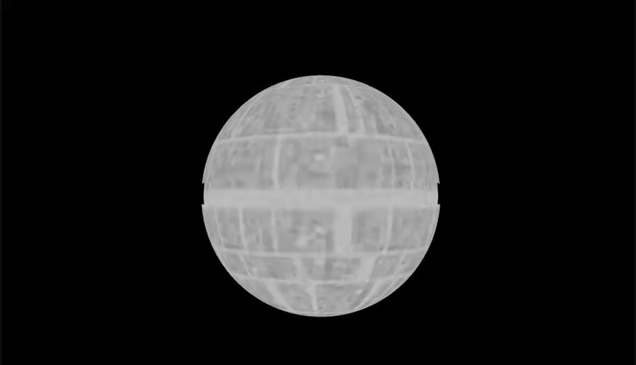</div>

<br>
<br>
<br>

# 🏜️ LOOPING ANIMATION 🏜️

##### SINCE THE MOON will rotate unitl it reaches the 360, we will need a loop to make the rotation infinite.

- In order to loop our animation, let’s remove the animation from the lifecycle and place it in a separate function:

```javascript
componentDidMount() {
    //
    // 1
    // we need to remove it from here

}

//
//
// 2
// AND ADD IT HERE ( in a new function)
//
spinAnimation() {
  Animated.timing(
    this.state.spin,
    {
     toValue: 1,
     duration: 3000,
     easing: Easing.linear
    }
  ).start();
}
```

#### THEN WE WANT TO CALL the freshly created function , inside the componentDidMount()

```javascript
componentDidMount() {
  this.spinAnimation();
}


```
